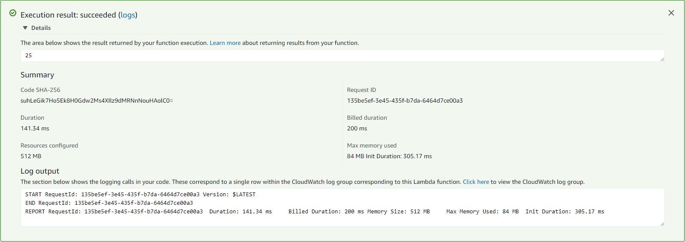
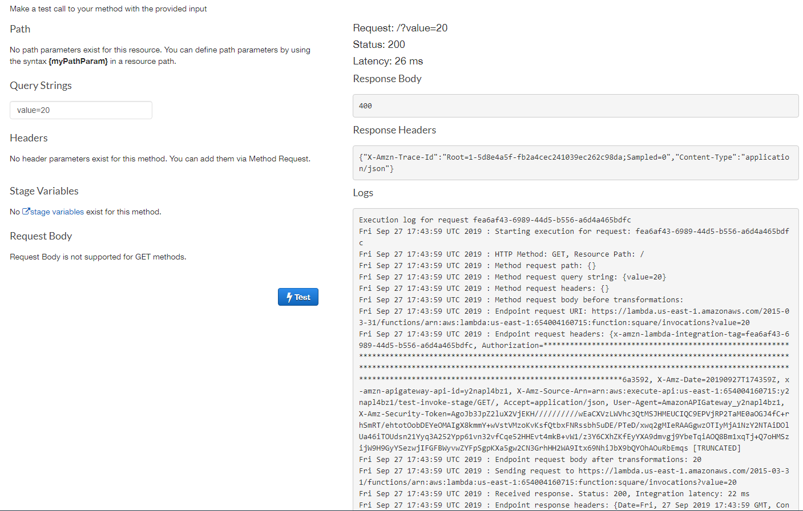
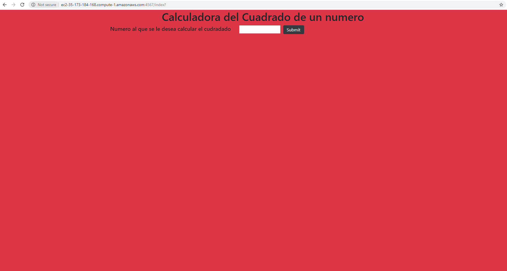
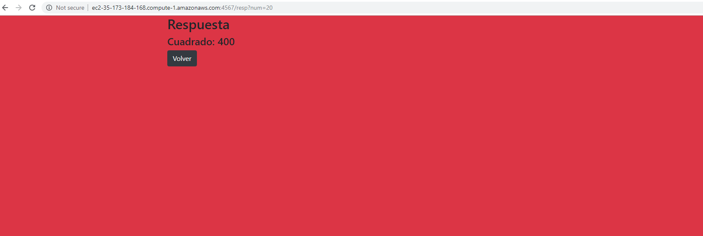
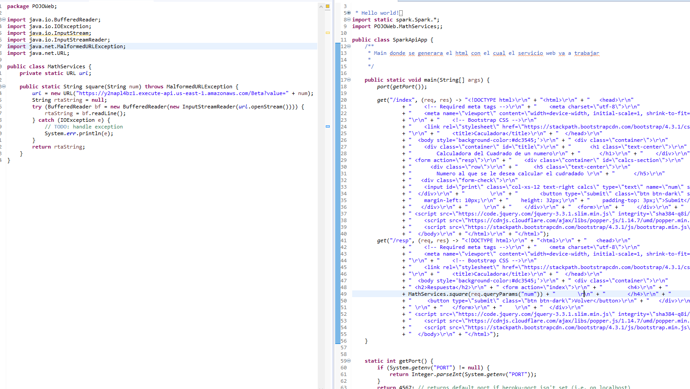

# Lab5Arep

En este proyecto se realizo la integracion entre servicios AWS: Lambda, API Gateway y una maquina virtual en EC2

### Pre-requisitos

No se debe tener ningun prerequisito.

### Documentación

La documentación se encuentra en la carpeta doc.

## Pruebas

 - Prueba funcion Lambda
	 
 - Prueba funcionamiento API Gateway
	
 - Conexión a la maquina 
	
 - Respuesta
	 
 - Codigo  
	 

## Autor

* **Javier Vargas** - *ECI*

## License

Este proyecto está licenciado bajo GNU  License v3.0 - ver [LICENSE](LICENSE) para más detalles.
